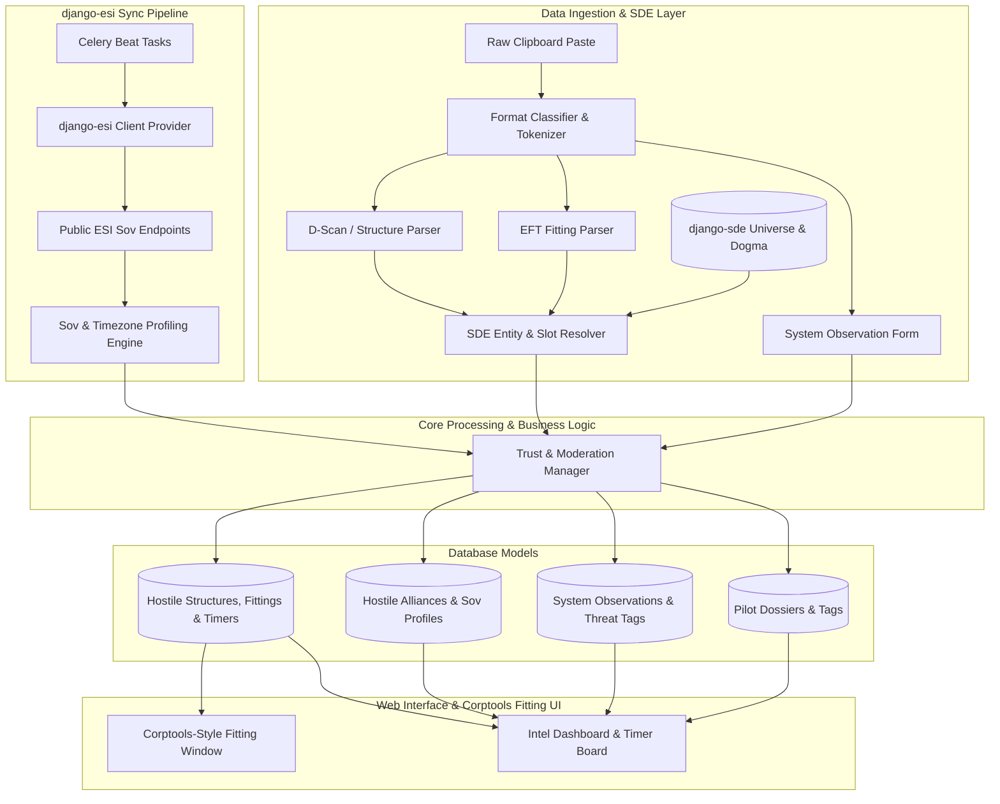

# Requirements

### Overview & Goals
The `aa-hostile-intel` application provides an Alliance Auth intelligence platform for tracking, reviewing, and analyzing hostile assets and activities. Taking design and architectural inspiration from standard ecosystem apps such as `corptools` (v3.5.0), it empowers intelligence officers, fleet commanders (FCs), and scouts to systematically record structure deployments, module fittings, vulnerability and anchor timers, hostile alliance sovereignty distributions, crowd-sourced system observations (e.g., gate camps, staging alerts), and hostile character dossiers (cyno alts, capital/super/titan pilots, and out-of-corp eyes).

### Scope
- **In Scope**:
  - Non-ESI structure intelligence parsing (D-Scan, Structure Show-Info clipboard paste, EFT fitting imports, core statuses, tether profiles).
  - Native integration with `django-sde` for universe data, type lookups, slot categorizations, and dogma attributes.
  - Public and authenticated ESI interactions via `django-esi` client providers with error handling and rate-limit backoff modeled after `corptools`.
  - Corptools-inspired interactive fitting windows featuring high/med/low/rig/service slots, CCP image server icons, dogma tooltips, and EFT export/copy.
  - Public ESI sovereignty tracking (`/sovereignty/map/`, `/sovereignty/campaigns/`, `/sovereignty/structures/`) and automated primary timezone inference (USTZ, EUTZ, AUTZ).
  - Crowd-sourced solar system intelligence (gate camp warnings, staging systems, cyno beacon warnings, threat tags, timestamped sitreps).
  - Hostile character dossiers and pilot tracking (character tags: Cyno Alt, Supercarrier Pilot, Titan Pilot, Fleet Commander, Dread Alt, Out-of-Corp Scout).
  - Tiered verification and trust system (members submit sightings; intel officers verify, pin, or archive reports).
  - Searchable structure registry, active timer board, and alliance intelligence profiles with DataTables.
  - Strict Alliance Auth code formatting, isort section headers, type annotations, and docstring standards.
- **Out of Scope**:
  - Authenticated private hostile structure ESI fetching (which requires hostile corporation director ESI tokens).
  - Direct live in-game chat logging scrapers or OCR screen capture tools.

### User Stories
- **As a Scout**, I want to paste raw D-scans or structure inspect text into a smart parser so that new hostile citadels, POSes, and fittings are cataloged without tedious manual entry.
- **As a Fleet Commander (FC)**, I want to inspect a hostile structure's interactive fitting window (high/med/low/rig/service slots) and check alliance timezone profiles to plan effective fleet compositions and engagement windows.
- **As a Line Member**, I want to check a solar system's threat level and submit crowd-sourced observations (e.g., "smartbomb camp on gate at 19:00 UTC") so that our members minimize travel losses.
- **As an Intel Officer**, I want to maintain character dossiers for known hostile cyno alts and supercapital pilots with verification controls so that the alliance maintains actionable, high-signal data.

### Functional Requirements
- `FR-1: Non-ESI Structure Parsing`: Ingest and parse D-Scan text, structure profile show-info text, and EFT fitting blocks to extract structure type, system, celestial position, owner ticker, and fitted modules.
- `FR-2: SDE Universe & Type Resolution`: Leverage `django-sde` models (`ItemType`, `SolarSystem`, `Constellation`, `Region`, dogma attributes) to resolve item IDs, names, structure slot layouts, and core requirements without hardcoded dictionaries.
- `FR-3: Corptools-Style Fitting Window`: Display structure and ship fittings in a dedicated, visually structured fitting layout (high, med, low, rig, service, ammo/fighters) with CCP type icons (`images.evetech.net`), slot badges, dogma attribute tooltips, and "Copy EFT" / "Export Pyfa" actions.
- `FR-4: django-esi Synchronization Pipeline`: Use `django-esi` client providers and token management to poll public ESI sovereignty and campaign endpoints asynchronously, managing ESI rate limits (status 420 / headers) and error backoffs.
- `FR-5: Sovereignty & Timezone Profiling`: Calculate hostile vulnerability distributions and identify primary operational timezones (USTZ, EUTZ, AUTZ) based on ESI sovereignty timers.
- `FR-6: Crowd-Sourced System Intelligence`: Allow alliance members to file system sitreps, tag system threat levels (e.g., `Staging`, `Gate Camp`, `Cyno Beacon`, `Heavy Bubble`), and add time-sensitive activity notes.
- `FR-7: Character Dossier & Role Tagging`: Track hostile pilots with customizable classification tags (`Cyno`, `Super Pilot`, `Titan Pilot`, `FC`, `Out-of-Corp Alt`) and sighting logs.
- `FR-8: Tiered Moderation Workflow`: Support unverified submissions by general members (`basic_access`) and verification/pinning/archiving by intel officers (`manage_intel`).
- `FR-9: Interactive Search & Timer Board`: Provide filterable DataTables and visual countdown timers with UTC and local timezone conversion.

### Non-Functional Requirements
- `NFR-1: Performance`: Rapid search indexing across thousands of structure and character records; background Celery processing for all external network I/O.
- `NFR-2: Code Standards & Formatting`: Follow Corptools and Alliance Auth best practices including `.flake8` (max line length 120), `.isort.cfg` categorized section headers, type hinting, and custom QuerySets/Managers.
- `NFR-3: Security & Permissions`: Granular Django permission layers ensuring sensitive intel is protected behind `basic_access` and `manage_intel`.
- `NFR-4: Compatibility`: Full compatibility with Alliance Auth 4.x / 5.x, Django 4.2 / 5.2, Bootstrap 5, `django-esi`, `django-sde`, and Celery Beat.

# Technical Design

### Current Implementation
The `aa-hostile-intel` repository contains an Alliance Auth app boilerplate with:
- An initial permission meta-model `General` in `hostile/models.py`.
- Basic menu hook and URL hook in `hostile/auth_hooks.py`.
- Stub views in `hostile/views.py` and empty task stubs in `hostile/tasks.py`.
- `.isort.cfg` configured with section headers: `# Standard Library`, `# Django`, `# Alliance Auth`, `# AA Hostile Intel`, `# Third Party`.
- Alliance Auth test environment configured under `testauth/`.

### Key Decisions
1. **django-sde Integration**: Use `django-sde` (or SDE type models) for all universe and item lookups (solar systems, regions, item types, dogma attributes for high/med/low/rig/service slots). This eliminates static lookup tables and ensures 100% accuracy with CCP SDE data.
2. **django-esi Client Architecture**: Model ESI integration after `corptools` (v3.5.0) using `django-esi` client providers (`esi.client.ESIClientProvider`), centralized error handling for ESI exceptions (`HTTPNotFound`, `HTTPUnauthorized`, `HTTPInternalServerError`, and rate limit 420), and retry with exponential backoff.
3. **Corptools-Inspired Fitting Windows**: Implement fitting presentation following Corptools' visual pattern with modular slot groupings (High, Medium, Low, Rigs, Service Modules, Charges/Fighters), CCP image server integration (`https://images.evetech.net/types/{type_id}/icon?size=32`), dogma tooltips, and single-click clipboard exports (EFT / Pyfa).
4. **Ingestion Architecture**: Hybrid Ingestion Pipeline. A Smart Ingestion paste modal auto-detects D-scans, structure inspect text, and EFT fits via regular expression tokenizer, with fallback to dedicated modal forms for granular manual entry.
5. **Code Style & Structure**: Strict adherence to Alliance Auth / Corptools coding conventions: typed models with custom `QuerySet` and `Manager` classes (`visible_to()`, `active()`, `upcoming()`), separation of business logic into `services/`, and standard isort heading annotations.

### Architecture Diagram

### Data Models & Contracts
- **HostileAlliance & HostileCorporation**:
  - `alliance_id` (BigIntegerField, unique), `alliance_name` (CharField), `ticker` (CharField).
  - `primary_timezone` (CharField: e.g. `USTZ`, `EUTZ`, `AUTZ`), `sov_timer_distribution` (JSONField).
- **HostileStructure**:
  - `structure_id` (BigIntegerField, nullable for unanchored/custom structures), `name` (CharField).
  - `structure_type_id` (IntegerField), `structure_type` (ForeignKey to `django_sde.models.ItemType`, null=True, on_delete=models.SET_NULL).
  - `solar_system` (ForeignKey to `django_sde.models.SolarSystem`, null=True, on_delete=models.SET_NULL).
  - `corporation` (ForeignKey to `HostileCorporation`, null=True), `alliance` (ForeignKey to `HostileAlliance`, null=True).
  - `core_status` (CharField: `FITTED`, `UNFITTED`, `UNKNOWN`).
  - `state` (CharField: `ANCHORING`, `UNANCHORING`, `ARMOR`, `HULL`, `ONLINE`, `REINFORCED`, `DESTROYED`).
  - `created_by` (ForeignKey to `User`), `is_verified` (BooleanField).
- **StructureFitting & StructureModule**:
  - `structure` (ForeignKey to `HostileStructure`, related_name="fittings"), `eft_format` (TextField).
  - `module_type` (ForeignKey to `django_sde.models.ItemType`), `slot_type` (CharField: `HIGH`, `MED`, `LOW`, `RIG`, `SERVICE`, `CHARGE`).
  - `slot_number` (PositiveSmallIntegerField), `is_online` (BooleanField).
- **StructureTimer**:
  - `structure` (ForeignKey to `HostileStructure`, null=True, related_name="timers").
  - `solar_system` (ForeignKey to `django_sde.models.SolarSystem`, null=True).
  - `timer_type` (CharField: `ANCHORING`, `UNANCHORING`, `ARMOR`, `HULL`, `SOV_IHUB`, `SOV_TCU`).
  - `timer_datetime` (DateTimeField), `created_by` (ForeignKey to `User`), `notes` (TextField).
- **SystemObservation**:
  - `solar_system` (ForeignKey to `django_sde.models.SolarSystem`).
  - `threat_level` (CharField: `LOW`, `MEDIUM`, `HIGH`, `EXTREME`).
  - `tags` (ManyToManyField to `SystemTag`: e.g. `Gate Camp`, `Smartbombing`, `Staging`, `Cyno Beacon`, `Capital Standby`).
  - `observation_text` (TextField), `active_hours` (CharField: e.g. `18:00-22:00 UTC`).
  - `created_by` (ForeignKey to `User`), `is_pinned` (BooleanField), `is_verified` (BooleanField), `created_at` (DateTimeField).
- **HostilePilotDossier**:
  - `character_id` (BigIntegerField, unique), `character_name` (CharField).
  - `corporation_name` (CharField), `alliance_name` (CharField).
  - `is_out_of_corp` (BooleanField), `is_cyno_alt` (BooleanField), `is_capital_pilot` (BooleanField), `is_super_pilot` (BooleanField), `is_titan_pilot` (BooleanField), `is_fc` (BooleanField).
  - `notes` (TextField), `last_seen_system` (ForeignKey to `django_sde.models.SolarSystem`, null=True), `last_seen_date` (DateTimeField).

### File Structure
- `hostile/`
  - `models.py`: All intelligence models (`HostileStructure`, `StructureFitting`, `StructureModule`, `StructureTimer`, `SystemObservation`, `HostilePilotDossier`, `HostileAlliance`).
  - `managers.py`: Custom Django QuerySets and Managers (`StructureQuerySet`, `TimerQuerySet`, `ObservationQuerySet`).
  - `parsers/`
    - `__init__.py`
    - `classifier.py`: Format detection (D-Scan, Show-Info, EFT, raw text).
    - `dscan.py`: D-Scan parsing logic.
    - `showinfo.py`: Structure clipboard text parser.
    - `eft.py`: EFT module fitting parser utilizing `django-sde` type and dogma resolution.
  - `services/`
    - `__init__.py`
    - `esi_client.py`: `django-esi` wrapper with rate-limiting, error handling, and retry helpers.
    - `sov_engine.py`: Public ESI sovereignty analysis and timezone inference.
    - `intel_manager.py`: Intel verification, auditing, and tagging logic.
  - `tasks.py`: Celery tasks for ESI sov sync, timer reminders, and cleanup of expired sitreps.
  - `views.py`: Dashboard, structure registry, corptools-style fitting window, timer board, pilot directory, and ingestion endpoints.
  - `forms.py`: Smart paste form and detailed modal edit forms.
  - `urls.py`: URL routing for web views, AJAX endpoints, and fitting modals.
  - `auth_hooks.py`: Alliance Auth menu items and navigation hooks.
  - `templates/hostile/`
    - `base.html`: Common layout and navigation.
    - `index.html`: Main dashboard with sitreps and active camp alerts.
    - `structures.html`: Structure registry and table view.
    - `fitting_modal.html`: Corptools-inspired fitting window (high/med/low/rig/service slots with CCP icon rendering).
    - `timers.html`: Interactive timer board with live countdowns.
    - `systems.html`: Solar system intelligence and threat map.
    - `pilots.html`: Hostile character dossiers and role tags.
    - `modals/smart_paste.html`: Universal quick-paste modal.
  - `tests/`
    - `test_parsers.py`: Parser tests with sample pastes and SDE lookups.
    - `test_tasks.py`: Celery sovereignty tasks tests with mocked `django-esi`.
    - `test_views.py`: Permission, dashboard, fitting window, and ingestion view tests.

# Testing

### Validation Approach
Automated and end-to-end unit tests will validate all core modules including regex parsers, `django-sde` integration, `django-esi` client tasks with mocked responses, fitting window rendering, data models, and view permission controls.

### Key Scenarios
- **D-Scan & Structure Show-Info Ingestion**:
  - Verify that pasting a multi-line D-scan correctly creates or updates `HostileStructure` records with correct structure type, celestial location, and solar system linked via `django-sde`.
  - Verify that pasting a structure profile with core status and fitting parses all high, mid, low, rig, and service modules accurately into `StructureFitting` and `StructureModule`.
- **Corptools-Style Fitting Window Rendering**:
  - Verify that fitting data renders correctly across slot categories with appropriate CCP image icons, slot labels, and dogma attribute tooltips.
  - Verify that "Copy EFT" exports standard valid EFT format strings for import into Pyfa or EVE Online client.
- **django-esi Sovereignty Synchronization**:
  - Mock `django-esi` client responses for `/sovereignty/structures/` and `/sovereignty/campaigns/` to verify that Celery tasks populate `HostileAlliance` sovereignty data without duplicate records.
  - Verify that timezone distribution engine accurately computes primary timezone clusters (e.g. 18:00–22:00 UTC -> EUTZ).
  - Verify that ESI rate limits (status 420) and transient 5xx errors trigger backoff retries without breaking task execution.
- **Crowd-Sourced Intel & Moderation Lifecycle**:
  - Verify that a standard user with `basic_access` can submit a system observation.
  - Verify that an intel officer with `manage_intel` can verify, edit tags, pin, or archive the observation.
- **Timer Board Functionality**:
  - Verify that timers calculate exact remaining time countdowns and render correctly in both UTC and user local time.
  - Verify that expired timers are archived or flagged appropriately.

### Edge Cases
- **Malformed Paste Input**: Ingestion parser handles corrupted or partial text without throwing 500 errors, returning user-friendly validation notices.
- **Out-of-Corp Character Tracking**: Characters who change corporations or act as neutral cyno eyes maintain persistent dossier history and tags.
- **django-esi Downtime / Rate Limiting**: Background Celery synchronization gracefully handles ESI errors and 420 rate limits with exponential backoff and retry mechanisms.

# Delivery Steps

### ✓ Step 1: Core Data Models, Permissions, and Admin Integration
Hostile intelligence database models and Django admin interfaces are created and migrated.

- Define `HostileAlliance`, `HostileCorporation`, and `HostilePilotDossier` models with affiliations and role tags (`is_cyno_alt`, `is_capital_pilot`, `is_super_pilot`, `is_titan_pilot`).
- Create `HostileStructure`, `StructureFitting`, `StructureModule`, and `StructureTimer` models referencing `django-sde` (`ItemType`, `SolarSystem`, `Constellation`, `Region`) for tracking Upwell structures, POSes, fittings, core states, and vulnerability/anchor timers.
- Create `SystemObservation` and `SystemTag` models for crowd-sourced notes, gate camp reports, and threat level indicators.
- Define custom QuerySets and Managers in `hostile/managers.py` for clean filtering (`visible_to()`, `active()`, `upcoming()`).
- Define custom permissions (`basic_access`, `manage_intel`, `officer_access`) and configure Django admin models with search, filters, and inlines.
- Generate and apply Django database migrations.

### ✓ Step 2: Non-ESI Clipboard & SDE-Driven Fitting Parsing Engine
Raw non-ESI clipboard text, D-scans, structure inspect windows, and EFT fittings are parsed into structured models using SDE lookups.

- Implement regex-based and tokenized parsers in `hostile/parsers/` to handle D-Scan formats (v3 and modern clipboard formats), structure show-info copy-pastes, and EFT ship/structure fitting blocks.
- Build an auto-detection classifier in `hostile/parsers/classifier.py` that identifies the incoming text format and extracts solar systems, celestial grids, owner tickers, structure names, and fitted modules.
- Utilize `django-sde` type and dogma resolution in `hostile/parsers/eft.py` to map fitted modules accurately to high, medium, low, rig, and service slots.
- Add unit tests validating parser accuracy across diverse copy-paste snippets and edge cases.

### ✓ Step 3: django-esi Public Sovereignty & Timezone Synchronization Pipeline
Background Celery tasks utilizing `django-esi` automatically synchronize public sovereignty data and calculate timezone vulnerability profiles.

- Create `django-esi` client wrapper in `hostile/services/esi_client.py` adhering to Corptools patterns for error handling, rate limiting (status 420), and retry backoff.
- Create Celery tasks in `hostile/tasks.py` utilizing public ESI endpoints (`/sovereignty/map/`, `/sovereignty/structures/`, `/sovereignty/campaigns/`).
- Build the timezone analysis engine in `hostile/services/sov_engine.py` to aggregate defense timer distributions and infer primary hostile operational timezones (e.g., `USTZ`, `EUTZ`, `AUTZ`).
- Implement automatic structure discovery and sov timer synchronization into `HostileStructure` and `StructureTimer` models.
- Configure periodic Celery Beat schedules in `hostile/app_settings.py` for background updates with exponential backoff on ESI errors.

### ✓ Step 4: Crowd-Sourced Intel, Pilot Dossiers, and Verification Workflow
Members can submit crowd-sourced observations while Intel Officers can verify, pin, or moderate reports.

- Implement submission workflows in `hostile/views.py` and `hostile/forms.py` for system observations, camp warnings, and pilot sightings.
- Build verification and trust management logic in `hostile/services/intel_manager.py` allowing officers with `manage_intel` permissions to mark reports as verified, pin active threats, or archive obsolete notes.
- Implement character dossier tracking with manual and auto-suggested tags (`Cyno Alt`, `Super Pilot`, `Titan Pilot`, `FC`, `Out-of-Corp Scout`).
- Create an audit log model `IntelAuditLog` to record edits, approvals, and report timestamps for operational transparency.

### ✓ Step 5: Corptools-Style Fitting UI, Timer Board, and Interactive Dashboards
Operators and alliance members have access to a responsive dashboard, Corptools-style fitting window, timer board, structure registry, and intel search.

- Build the main dashboard template `hostile/templates/hostile/index.html` featuring active gate camp alerts, upcoming structure timers, and high-threat system summaries.
- Implement the Structure Registry view with DataTables filtering by region, solar system, owner alliance, structure type, and core status.
- Implement the Corptools-inspired interactive Structure Fitting modal (`fitting_modal.html`) rendering High, Med, Low, Rig, and Service slots with CCP icon images (`images.evetech.net`), slot counts, dogma tooltips, and "Copy EFT" buttons.
- Build the Timer Board view with countdown timers, timezone conversion, and calendar exports.
- Implement the Pilot Dossier & Alliance Overview views displaying timezone distribution charts and associated cyno/capital pilots.
- Create the Smart Intel Paste modal enabling one-click bulk ingestion directly from the navigation bar.

### ✓ Step 6: Auth Hooks, Code Formatting Standards, Test Coverage, and Documentation
Menu hooks, permission checks, isort/flake8 compliance, end-to-end integration tests, and documentation are complete.

- Update `hostile/auth_hooks.py` with menu entries, badge indicators for active timers, and strict permission gating.
- Ensure all codebase files adhere to Corptools/AA formatting standards: `.flake8` (max line length 120), `.isort.cfg` categorized section headers, type hinting, and custom QuerySets/Managers.
- Implement comprehensive Django test cases in `hostile/tests/` covering views, Celery tasks, permission boundaries, fitting windows, and model methods.
- Document configuration settings, Celery Beat task setups, SDE dependencies, and intel ingestion guides in `README.md` and user documentation.